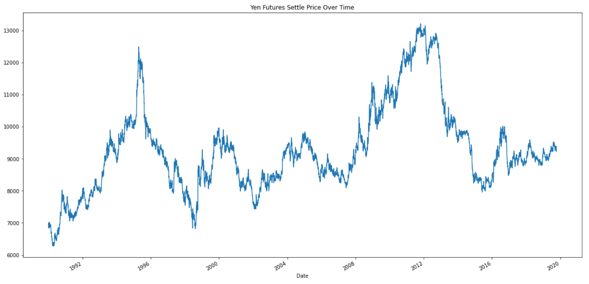
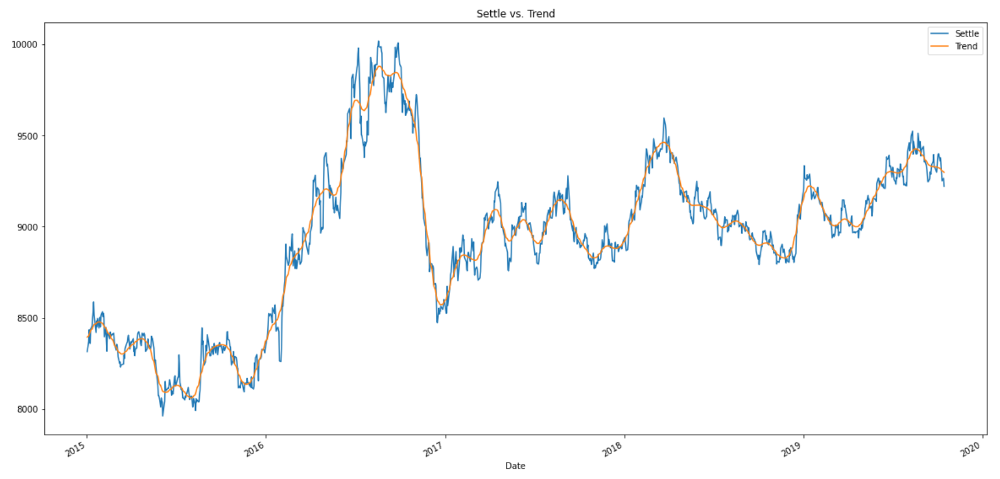
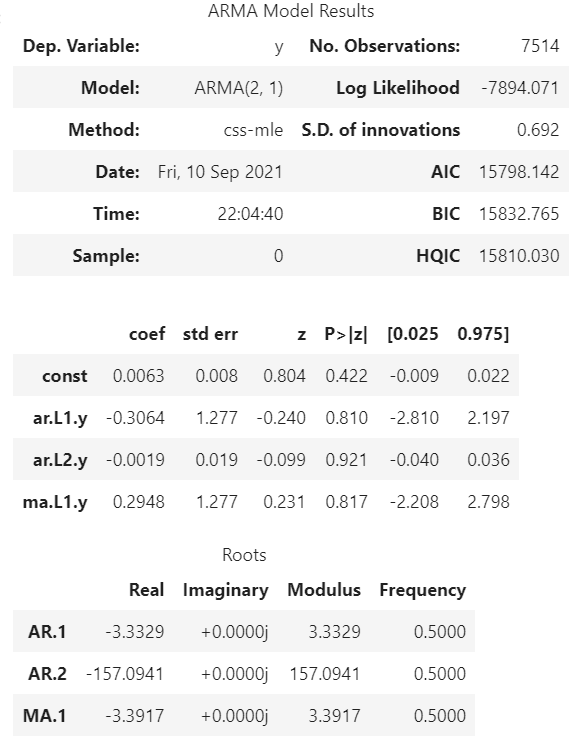
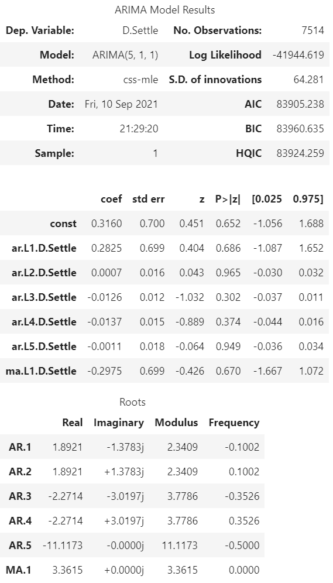
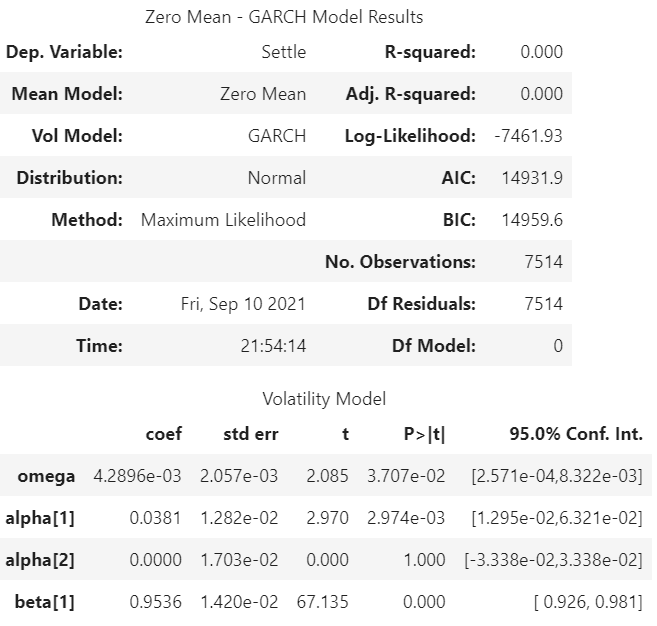
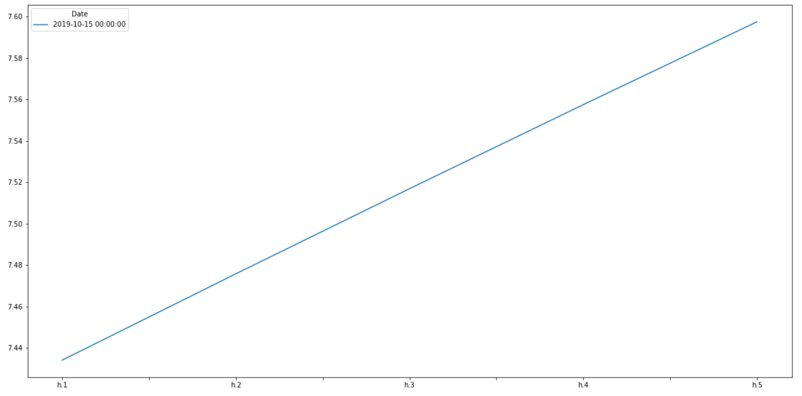
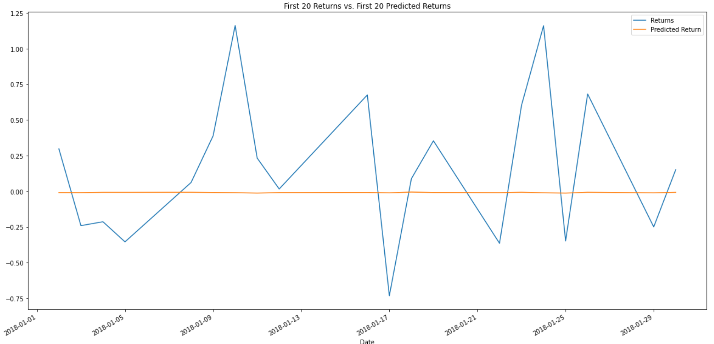

# Time-Series and Linear Regression Analysis of YEN vs. USD

## Background
This is a Python project that is tasked with forecasting the the price of the Japanese Yen versus the US Dollar. We used the ARMA, ARIMA and GARCH forecasting models using the p-values as our guide. The Hodrick-Prescott filter was used to remove the cyclical components of the time-series data. 

For the Linear Regression portion of the exercise, we used the SKLearn LinearRegression and mean_squared_error modules.

Data used:
[Yen Data CSV File](Starter_Code/yen.csv) We filtered this data down to only since Jan 01 1990.

#

## Time-Series Analysis:
[Time-Series Starter Notebook](Starter_Code/time_series_analysis.ipynb)

Initial Plot of Raw Time-Series Price data:

Steps for Analysis:
1. Decompose the data using the Hodrick-Prescott Filter into trend and noise:   

        ts_noise, ts_trend = sm.tsa.filters.hpfilter(yen_futures['Settle'])
2.  Combined the settle, noise and trend data into one dataframe and then plotted data since 2015 only:

        settle_df = pd.DataFrame(yen_futures['Settle'], columns = ['Settle'])
        settle_df['Noise'],settle_df['Trend'] = ts_noise,ts_trend
        settle_df_2015_to_now = settle_df.loc['2015-01-01':]
        settle_df_2015_to_now.plot(y=['Settle', 'Trend'], figsize = (20,10), title="Settle vs. Trend")

3. Forecast settle price using ARMA model:

        # Estimate an ARMA model
        model = ARMA(returns.values, order=(2,1))

        # Fit the model and assign it to a variable called results
        results = model.fit()

Results from ARMA:

4. Forecast settle price using ARIMA model:

        # Estimate an ARIMA Model:
        model = ARIMA(yen_futures['Settle'], order=(5,1,1))

        # Fit the model
        results_arima = model.fit()

Results from ARIMA:

5. Forecast Volatility using a GARCH model:

        # Estimate a GARCH model:
        model = arch_model(returns, mean="Zero", vol="GARCH", p=2, q=1)

        # Fit the model
        res = model.fit(disp="off")

Results from GARCH summary:

GARCH volatility prediction plot for the next 5 days:

Questions to Answer:
1. Based on your time series analysis, would you buy the yen now?

    ***I most certainly would not buy the yen now, at least not based on the analysis we have completed.. Both the ARMA and ARIMA models have p-values greater than .05 meaning that they are not considered 'statistically significant' predictions, in other words, not good a 'fit'.***

2. Is the risk of the yen expected to increase or decrease?
    
    ***The risk of the yen is expected to increase based on the results form the GARCH model.***

3. Based on the model evaluation, would you feel confident in using these models for trading?

    ***I would not feel confident trading using these models as I am not very comfortable with them. I am however quite familiar with traditional Technical Analysis, so I would probably use this method of analysis.***

#

## Linear Regression Analysis:

### Steps taken for analysis:

1. First, I imported the same data via .csv, filtered out only the 1990+ data and added a returns and lagged returns column into the dataframe.  
2. After importing and cleaning the data, I split the data into a training and test split. I used the 1990-2017 data as the training set and the 2018-2019 data as the test set.

       # Create a train/test split for the data using 2018-2019 for testing and the rest for training
       
        train = yen_futures[:'2017']
        test = yen_futures['2018':] 
        X_train = train["Lagged_Returns"].to_frame().replace(-np.inf, np.nan).dropna()
        X_test = test["Lagged_Returns"].to_frame().replace(-np.inf, np.nan).dropna()
        y_train = train["Returns"].replace(-np.inf, np.nan).dropna()
        y_test = test["Returns"].replace(-np.inf, np.nan).dropna()

3. I then setup a LinearRegression Model and fit and predicted results:
        # Create model and fit
        model = LinearRegression()
        model.fit(X_train, y_train)     
        
        # Make a prediction of "y" values using just the test dataset
        y_prediction = model.predict(X_test)
        results_df = y_test.to_frame()
        results_df["Predicted Return"] = y_prediction

        # Plot the first 20 predictions vs the true values
        results_df[:20].plot(y=['Returns', 'Predicted Return'], figsize = (20,10), title="First 20 Returns vs. First 20 Predicted Returns")  

Plot:

4. Then we calculated the RMSE (Root Mean Squared Error) for both the Out-of-Sample and In-Sample data to compare the 2 data sets.
    #### Out-of-Sample Data:
        # Calculate the mean_squared_error (MSE) on actual versus predicted test "y" 
        mse = mean_squared_error(
            results_df["Returns"],
            results_df["Predicted Return"]
        )

        # Using that mean-squared-error, calculate the root-mean-squared error (RMSE):
        rmse = np.sqrt(mse)
    #### In-Sample Data:
    
        # Construct a dataframe using just the "y" training data:
        in_sample = y_train.to_frame()

        # Add a column of "in-sample" predictions to that dataframe:  
        in_sample["In-sample Predictions"] = model.predict(X_train)

        # Calculate in-sample mean_squared_error (for comparison to out-of-sample)
        in_sample_mse = mean_squared_error(
            in_sample["Returns"],
            in_sample["In-sample Predictions"]
        )

        # Calculate in-sample root mean_squared_error (for comparison to out-of-sample)
        in_sample_rmse = np.sqrt(in_sample_mse) 

# 

Outputs:

Out of Sample Root Mean Squared Error (RMSE): 0.4154834983842043

In-sample Root Mean Squared Error (RMSE): 0.5969835285643179

# 

## Conclusion for Linear Regression:
Based on the RMSE for in-sample and out-of-sample data, the model is stating that the out-of-sample test data (which it has never seen before) makes a better prediction (Lower RMSE = better prediction), which is probably not a good thing. We would likely want to use a different model, one that ends up with the in-sample RMSE being lower than the out-of-sample data.